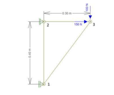
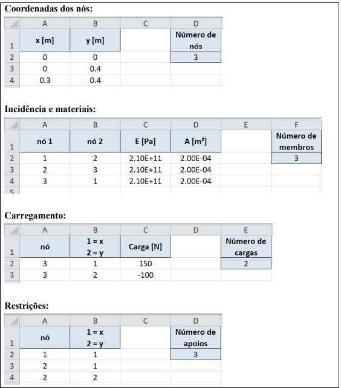
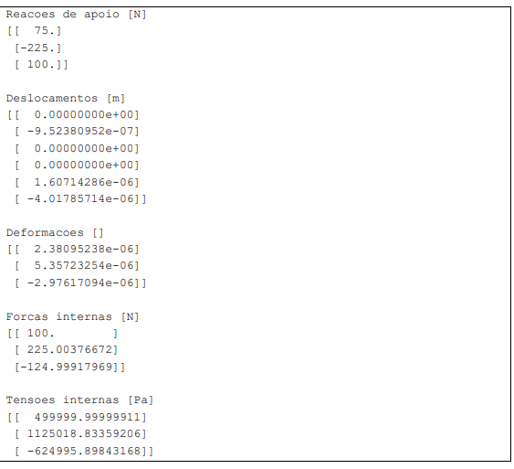
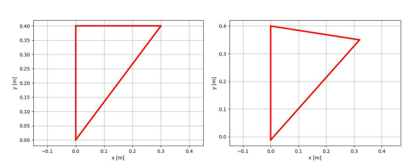
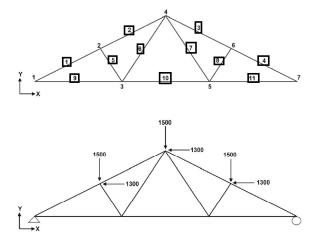

# APS 4: PROJETO DE SOFTWARE PARA ANÁLISE DE TRELIÇAS PLANAS
-------------------------

### 1. OBJETIVO GERAL
O objetivo da atividade é desenvolver um software para análise de treliças planas. 

### 2. RUBRICA
- O código deverá ser desenvolvido em Python de modo que os dados de entrada possam ser facilmente alterados a partir de uma planilha como descrito no Anexo 1.
- O código deverá aplicar técnicas numéricas para solução de sistemas de equações (Método de Jacobi e/ou Gauss-Seidel).
- O código deverá gerar um arquivo de saída com o pós-processamento dos dados de acordo com modelo descrito no Anexo 1. 
- O código deverá ser desenvolvido para aplicação geral em treliças 2D. Para isso, o grupo deverá validar os dados de saída, usando a estrutura indicada no Anexo 2. 

### ANEXO 1

A seguir apresentamos um modelo de arquivo de entrada para análise da treliça ilustrada na Fig. 1. 

## Treliça com 3 elementos de Barra
 

### Especificações das Barras

Cada barra do exemplo possui as seguintes características:
* **Área de seção transversal (A)**: `2 × 10^-4 m²`
* **Módulo de elasticidade (E)**: `210 GPa`

### Cargas Aplicadas

As cargas pontuais aplicadas são:
* **No nó 3, direção y**: `P_y = -100 N`
* **Na direção x**: `P_x = 150 N`

### Tensões Ultimate

As tensões últimas tanto para tração quanto para compressão são:
* **Tensão última à tração (σₜₐₓₐçãₒ)**: `1570 × 10^3 Pa`
* **Tensão última à compressão (σₜₐₓₐₘₑₙₜₒ)**: `1570 × 10^3 Pa`

## Arquivo de entrada

## Arquivo de saída

## Pós Processamento da Treliça plana com 3 elementos

A figura ilustra o pós-processamento para a análise da treliça plana com três elementos. (Esquerda) Treliça antes da aplicação das forças. (Direita) Treliça após a aplicação das forças. 

### ANEXO 2

Considere a estrutura ilustrada abaixo para validação do software desenvolvido. Adote a numeração indicada para os nós e elementos. 

## Descrição do Modelo
- Estrutura bidimensional e conectada por juntas do tipo rótula (Treliça). 
- Estrutura pinada na esquerda, e apoiada na extremidade direita.

## Material: AISI 310 Stainless Steel (SS)

Propriedades Mecânicas:
- **Módulo de Elasticidade (E)**: `193.14 GPa`
- **Área de Seção Transversal (A)**: `5.25 mm²`

## Coordenadas dos Nós

| Nó | x [mm] | y [mm] |
|----|--------|--------|
| 1  | 0      | 72     |
| 2  | 144    | 144    |
| 3  | 192    | 0      |
| 4  | 288    | 72     |
| 5  | 384    | 0      |
| 6  | 432    | 72     |
| 7  | 576    | 0      |

## BIBLIOGRAFIA:
- BITTENCOURT, M.L. COMPUTATIONAL SOLID MECHANICS: VARIATIONAL FORMULATION AND HIGH ORDER APPROXIMATION, 6A EDIÇÃO, CRC PRESS, 2014.
- CHAPRA, STEVEN C.; CANALE, RAYMOND P. NUMERICAL METHODS FOR ENGINEERS. 6TH ED. NEW YORK: MCGRAW-HILL HIGHER EDUCATION, C2010. 968 P. ISBN 978007340106 (ENC.)
- NOTAS DE AULA E TEXTOS FORNECIDOS AO LONGO DO SEMESTRE. 